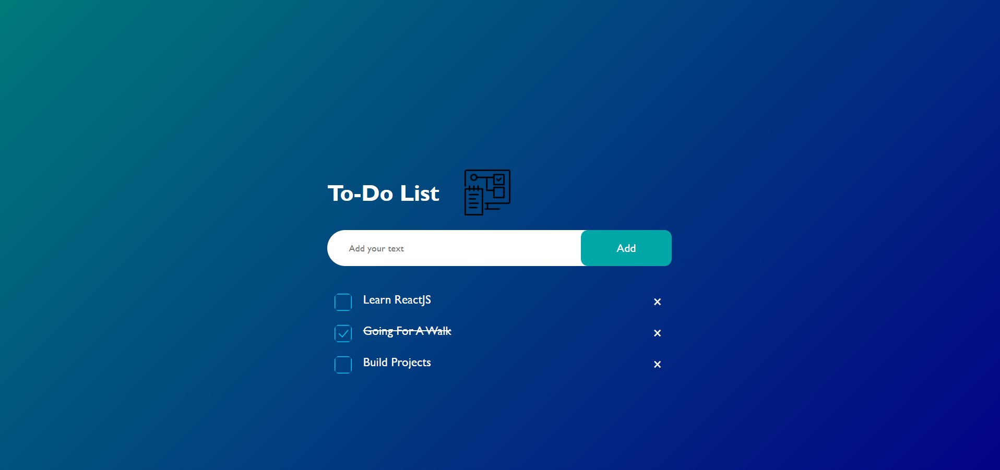

# To-Do List Webpage

This repository contains the code for a simple to-do list webpage created using HTML, CSS, and JavaScript.

## Preview

## Features

- Add tasks to your to-do list.
- Mark tasks as completed.
- Delete tasks from the list.
- Responsive design for various screen sizes.

## Technologies Used

- HTML
- CSS
- JavaScript

## How to Use

1. Clone the repository to your local machine.
2. Open `index.html` in your web browser.
3. Start adding tasks to your to-do list!
4. Check off completed tasks and delete them as needed.

